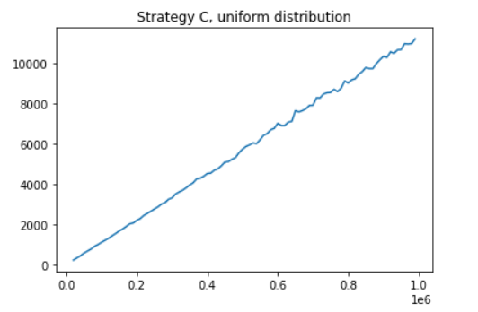

## Поиск элемента в массиве
Требуется осуществить алгоритм поиска в массиве целых чисел двумя способами: полный перебор и бинарный поиск (для упорядоченного массива); и найти их асимптотическую сложность. 
**Поиск полным перебором**:
```C++
int exhaustive_search(int *numbers, int N, int a){
    for (int i=0; i!=N; i++){
        if(numbers[i] == a) return i;
    }
    return -1;
}
```
**Бинарный поиск:**
```C++
int binary_search(int *numbers, int N, int a){
    int i_lower=0, i_upper=N-1, i_mid;
    while (i_lower != i_upper){
        i_mid = (i_lower+i_upper)/2;
        if (numbers[i_mid] == a) return i_mid;
        if (numbers[i_mid] > a) i_upper = i_mid;
        else i_lower = i_mid+1;
    }
    if (numbers[i_lower] == a) return i_lower;
    else return -1;
}
```
Код для измерения асимптотики худшего случая (элемент не содержится в массиве):
```C++
#include<iostream>
#include<chrono>

int search(int *numbers, int N, int a);

int main(){
    unsigned T = 10000; // число поисков в одном измерении
    int *numbers = new int[1000000];
    for (int i=0; i!=1000000; i++){
        numbers[i] = i;
    }
    for (int N=10000; N!=1000000; N+=10000){ // диапазон размера массива
        std::cout<<N<<',';
        auto begin = std::chrono::steady_clock::now();
        for (int i=0; i!=T; i++){
            search(numbers, N, -1);
        }
        auto end = std::chrono::steady_clock::now();
        auto time_span = std::chrono::duration_cast<std::chrono::milliseconds>(end - begin);
        std::cout<<time_span.count()<<'\n';
    }
    delete[] numbers;
    return 0;
}
```
Код для измерения асимптотики среднего случая:
```C++
#include<iostream>
#include<chrono>
#include<random>

int search(int *numbers, int N, int a);

unsigned log10(int N){
    unsigned ans = 0, accum = 1;
    while (N > accum){
        ans++;
        accum *= 10;
    }
    return ans;
}

void get_test_seq(unsigned *test_seq, int N, unsigned T){
    int arr[] = {0, 1, 2, 3, 4, 5, 6, 7, 8, 9};
    unsigned seed = 1001;
    std::default_random_engine rng(seed);
    std::uniform_int_distribution<unsigned> dstr(0, 9);
    unsigned n = log10(N);
    for (unsigned i=0; i!=T; i++){
        unsigned a = 0;
        for (unsigned j=0; j!=n; j++){
            a = a*10 + arr[dstr(rng)];
        }
        while (a > N){
            a = 0;
            for (unsigned j=0; j!=n; j++){
                a = a*10 + arr[dstr(rng)];
            }
        }
        test_seq[i] = a;
    }
}

int main(){
    unsigned T = 10000;
    int *numbers = new int[1000000];
    for (int i=0; i!=1000000; i++){
        numbers[i] = i;
    }
    for (int N=10000; N!=1000000; N+=10000){
        std::cout<<N<<',';
        unsigned *test_seq = new unsigned[T];
        get_test_seq(test_seq, N, T);
        auto begin = std::chrono::steady_clock::now();
        for (int i=0; i!=T; i++){
            search(numbers, N, numbers[test_seq[i]]);
        }
        auto end = std::chrono::steady_clock::now();
        auto time_span = std::chrono::duration_cast<std::chrono::milliseconds>(end - begin);
        std::cout<<time_span.count()<<'\n';
        delete[] test_seq;
    }
    delete[] numbers;
    return 0;
}
```
Для обоих случаев в качестве массива целых чисел использовался массив numbers = [1, 2, ... , N]. Переменная T – число поисков в одном измерении – настраивается руками для каждого алгоритма, чтобы обеспечить разумную продолжительность тестов. Результаты работы программ я скопировал в отдельные текстовые файлы для построения графиков зависимости времени поиска от размера массива, используя следующий код в Jupyter Notebook:
```Python
import pandas as pd 
import matplotlib.pyplot as plt
data = pd.read_csv("C:\\ ... \\data.txt").to_numpy()
plt.title(" ____ search, ____ case")
plt.plot(data[:, 0], data[:, 1])
```
Графики:


По оси ординат отложено время, за которое программа выполняет T поисков. Видно, что асимптотика линейная, что ожидаемо. 


Эти же графики с отлогарифмированной осью абсцисс:


Выглядит довольно прямо, что говорит о том, что асимптотика алгоритма $O(logN)$. 
Для бинарного поиска удобно выбрать шаг по N таким, чтобы на отлогарифмированном графике точки были распределены равномерно. Также здесь нижний предел Nmin = 10000, когда нужно было взять Nmin = 100. 
Я потратил 3 часа, но вот новые данные сразу в отлогарифмированном масштабе:


Ещё я случайно удалил предыдущие данные, поэтому их будет не хватать в прикреплённых файлах. Будут данные, показанные на последних 2-х графиках. Аналогично с кодом – во вложениях только финальная версия. Добавил там счётчик прогресса и предполагаемое оставшееся время выполнения измерений.
Только что случайно стёр данные binary_search_average_case, когда заново запустил код. Я не специально это делаю, честно. Сейчас времени на переизмерение нет уже...
## Сумма двух
**Полный перебор:**
```C++
void find_pair_straightforward(int *numbers, int *pair, int N, int S){
    for (int i=0; i!=N; i++){
        for (int j=0; j!=N; j++){
            if (numbers[i] + numbers[j] == S){
                pair[0] = i;
                pair[1] = j;
            }
        }
    }
}
```
**Поиск с линейной асимптотикой:**
```C++
void find_pair_linear(int *numbers, int *pair, int N, int S){
    int i = 0, j = N-1;
    int Z = numbers[i] + numbers[j];
    while (Z != S && i != j){
        if (Z > S) j--;
        else i++;
        Z = numbers[i] + numbers[j];
    }
    if (i != j){
        pair[0] = i;
        pair[1] = j;
    }
}
```
Как устроен тестировщик, посмотрите сами, пожалуйста, в папке "Sum_of_two". Там я уже не стал делать крутой счётчик прогресса, потому что я его придумал уже после того, как добыл данные для этого пункта. Собственно, вот они:


Эти же графики, но значения по оси абсцисс возведены в квадрат:


Асимптотика $O(N^2)$, чтд.


Асимптотика $O(N)$, чтд.
## Часто используемый элемент
**Стратегия A:**
```C++
int strategyA(int *numbers, int N, int a){
    if (numbers[0] == a) return 0;
    for (int i=0; i!=N; i++){
        if (numbers[i] == a){
            swap(numbers, 0, i);
            return 0;
        }
    }
    return -1;
}
```
**Стратегия B:**
```C++
int strategyB(int *numbers, int N, int a){
    if (numbers[0] == a) return 0;
    for (int i=0; i!=N; i++){
        if (numbers[i] == a){
            swap(numbers, i-1, i);
            return i-1;
        }
    }
    return -1;
}
```
**Стратегия C:**
```C++
int strategyC(int *numbers, int *counters, int N, int a){
    if (numbers[0] == a){
        counters[0]++;
        return 0;
    }
    for (int i=0; i!=N; i++){
        if (numbers[i] == a){
            counters[i]++;
            if (counters[i] > counters[i-1]){
                swap(numbers, i-1, i);
                swap(counters, i-1, i);
                return i-1;
            }
            return i;
        }
    }
    return -1;
}
```
### Внимание, ниже будет часть отчёта, которую никто не спрашивал. Результаты и их обсуждение в самом конце.
Немного о том, как я добился неравномерного распределения вероятности попадания элементов. Я задал целочисленную функцию f, пропорциональную функции распределения вероятности. Например, если распределение линейное, то f будет таким:
```C++
int f(int x){
    return 1 + x/1000;
}
```
Коэффициент 1/1000 поясню чуть позже. Эта функция даёт каждому индексу i в исходном массиве своё целое число f(i), пропорциональное вероятности того, что при выборе попадётся элемент с этим индексом. Остаётся отнормировать это число f(i), поделив его на "интеграл" функции f по множеству [0, 1, ... , N], обозначим это число за S. Разумеется, на самом деле это сумма, но идея та же самая. Потом я создал массив integral_f[N], в котором каждое значение integral_f[i] = "интегралу" функции f по множеству [0, 1, ... , i]. Наконец, чтобы получить индекс элемента, который будет искать наши функции с разными стратегиями, мы генерируем рандомное число от 0 до S, с помощью бинарного поиска находим между какими индексами расположилось бы это число в массиве integral_f, и берём меньшее из них.
У моего подхода есть недостаток. Функцию f трудно подбирать руками так, чтобы одновременно точно передать плавность распределения вероятности и не выйти за пределы int'а, потому что S становится большим очень легко. S должен быть меньше 2,147,483,647, но он является суммой 1 миллиона int'ов, следовательно среднее значение <f(i)> = 2147. Довольно маленькое число, в идеале оно должно быть сколько угодно большим, а тут ограничение. Этим и объясняется коэффициент 1/1000. Если взять f(x) = 1 + x, то S выйдет за пределы int'а. 
Короче говоря, мой подход – полная лажа, и можно было сделать в 10 раз легче и лучше, но я докажу, что эту лажу по части кода я написал нормально. 


Программу, которая эти данные выдавала я уже потерял, но она работала с массивом counters. Она много раз прогонала случайный выбор элемента, и если выпал индекс i, то прибавлял counters[i]++. Также у меня массив из 100 элементов был по какой-то причине. Короче всё работает окда.
### Результаты и обсуждение




Теперь про результаты. Асимптотика не менялась от вида распределения вероятности, и это довольно логично, потому что чем больше элементов тем больше элементов будут иметь большую вероятность. В смысле, если распределение не меняет свой вид, то во сколько раз больше элементов, во столько раз нужно больше сравнений. Даже если упорядочить массив по убыванию вероятности, асимптотика будет та же. 
Второй важный момент – это то, что наклон прямой в случае неравномерного распределения больше, чем в случае равномерного. Это тоже легко объяснить. Я взял f(x) = 1 + x/1000, то есть исходный массив был упорядочен по возрастанию вероятности – худший вариант из возможных, а стратегии просто не успевают упорядочить массив из $1,000,000 \leq N \leq 10,000$ элементов за $T = 10,000$ итераций. Если взять гораздо больший T, то я не успею дописать эту лабу, но зато смогу пронаблюдать "изменение" асимптотики. Изменения в кавычках, потому что асимптотика всё равно линейная, но на графике можно будет наблюдать изменение коэффициента наклона. Точнее будет следующая картина: при малых N алгоритмы успевают упорядочить массив и некоторое время находить элементы в нём в таком состоянии. Среднее время поиска будет близко к оптимальному. С возрастанием N степень упорядочивания будет уменьшаться (так как T – количество поисков при каждом N – постоянно. Больше массив => больше действий для упорядочивания => меньшая часть работы сделана, если всегда делается только T прогонов), время будет уходить дальше от оптимального, коэффициент наклона растёт. При очень больших N (по отношению к T сравнимо: N ~ T, поскольку характерное количество итераций, необходимых для упорядочивания, много больше N), упорядочивание массива будет пренебрежимо мало, график выйдет на линейную зависимость с максимальным коэффициентом наклона. 
На графиках, которые я привёл именно это и происходит – Nmin = T = 10,000 – массив не упорядочивается, коэффициент наклона максимальный.

